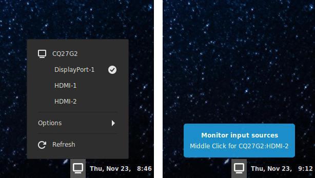

# Monitor Input Source
A cinnamon applet that allows you to change the input source your monitors are using.



Perfect for people who have two computers connected to different input sources on a monitor.
Quicker and easier then reaching for the buttons on the monitor

This applet uses [ddcutil](https://www.ddcutil.com/) to communicate with your monitor and send commands
that will change the current input source that the monitor is using. This allows you to quickly change the
input source for all monitors connected to your PC.

## Requirements
The [ddcutil](https://www.ddcutil.com/) package must be installed for this applet to opperate correctly. It's recommended that ddcutil 2.0
or better is installed for optimial ease of use and performance, but older versions will work fine if you follow the instructions below.

```
sudo apt-get install ddcutil
```

If your package respsitory does not currently offer ddcutil 2.0 or better (i.e. Linux Mint 21.2 at the moment)
then you will need to add your user to the i2c group and then logout and back in again for the change to take
effect:
```
sudo groupadd --system i2c  #If the group does not exist yet
```
```
sudo usermod -G i2c -a $USER
```
See: https://www.ddcutil.com/i2c_permissions/

Even better, install ddcutil 2.0:

See: https://www.ddcutil.com/install/

or build from the source:

https://www.ddcutil.com/building/

## Installation
For the latest development version:
1. Clone the repo (or Download the latest repo by clinking on the green "code" button above then click "Download ZIP")
    ```
    git clone git@github.com:klangman/MonitorInputSource.git
    ```
2. If you downloaded a ZIP, decompress the zip into a directory of your choice
    ```
    unzip ~/Downloads/MonitorInputSource-main.zip
    ```
3. Change directory to the cloned repo or the decompressed ZIP file
4. Link the "MonitorInputSource@klangman" directory into the "~/.local/share/cinnamon/applets/" directory
    ```
    ln -s $PWD/MonitorInputSource@klangman ~/.local/share/cinnamon/applets/MonitorInputSource@klangman
    ```
5. Right click on the cinnamon panel that you wish to add MonitorInputSource to and click "Applets"
6. Select the "Monitor Input Source" entry and then click the "+" button at the bottom of the Applet window
7. Right click on the cinnamon panel and use "Panel edit mode" to enable moving the applet within the panel
8. Right click on the cinnamon panel and disable "Panel edit mode"

## Feedback
Please, if you find any issues, feel free to create an issue here on Github. Thanks!
